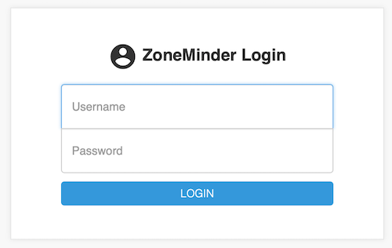
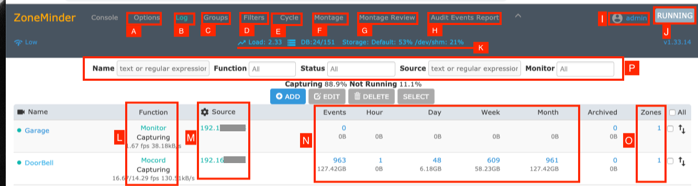
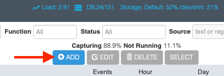
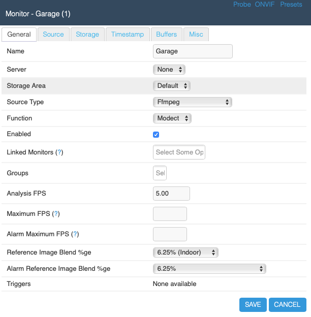
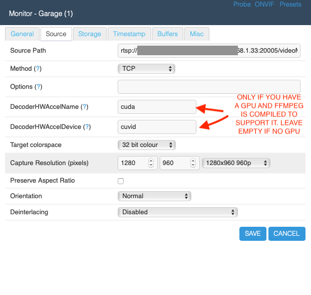
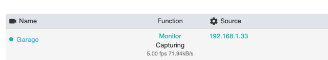

# Introduction
---
Using zoneminder to monitor the Discover CCRI test site with multiple
RTSP based IP cameras. Modified documentation sourced from 
[ZoneMinder](https://zoneminder.readthedocs.io/en/latest).

# Contents
1. [Overview & Dependencies](#zoneminder-overview)
2. [Build + Install](#build)
3. [Application Setup](#application-setup)
4. [Adding Cameras](#adding-cameras)

# Zoneminder Overview
ZoneMinder is an integrated set of applications which provide a complete surveillance 
solution allowing capture, analysis, recording and monitoring of any CCTV or security 
cameras attached to a Linux based machine. It is designed to run on distributions which 
support the Video For Linux (V4L) interface and has been tested with video cameras 
attached to BTTV cards, various USB cameras and also supports most IP network cameras.

### Minimal dependencies
> **Note** This assumes you are running a Linux distro more specifically Debian.
> If you are running a different OS please see the official ZoneMinder 
> [documentation](https://zoneminder.readthedocs.io/en/latest/index.html)

**Fetch updates**
```
$ sudo apt-get update
```

**Install Docker**
Can use this method or your own. 
```
$ curl -sSL https://get.docker.com | sh
```
add user to docker grp and fix perms on docker sock <br>
```
$ sudo usermod -aG docker pi
$ sudo chmod 666 /var/run/docker.sock 
```
confirm installation by checking version and running hello world container 

# Build
---
enter the zmdockerfiles directory and run:
```
docker run -d -t -p 8080:80 \
    -e TZ='America/Phoenix' \
    -v ~/zoneminder/events:/var/cache/zoneminder/events \
    -v ~/zoneminder/images:/var/cache/zoneminder/images \
    -v ~/zoneminder/mysql:/var/lib/mysql \
    -v ~/zoneminder/logs:/var/log/zm \
    --shm-size="512m" \
    --name zoneminder \
    zoneminderhq/zoneminder:latest-ubuntu18.04
```
The application will now be viewable at http://localhost:8080/zm/

```
$ docker --version
$ docker run hello-world
```        
**Install ngrok for proxying, making localhost visible to outside**

```
$ python3 -m pip install pyngrok
```
Visit here for more directions: https://pyngrok.readthedocs.io/en/latest/
- You'll want to [create an ngrok account](https://dashboard.ngrok.com/get-started/setup) and 
add your authtoken to the ngrok agent as well as add your API-key to the ngrok config file. 
```
$ ngrok config add-authtoken <authtoken>
``` 
- after setting up ngrok open up port 8080 to forward publicly 
- run the reverse_proxy.py script
```
$ ngrok http 8080

# to run in the background
$ screen -d -m ngrok 8080

# view generated sessions 
$ curl http://127.0.0.1:4040/api/tunnels
``` 
this will open an ngrok session and provide you with the generated public facing
URL of your project. The url will be viewable at <generated_URL>/zm.

# Application Setup
Visit the above URL and the following login display will appear. Note that the default
login-password credentials are `admin-admin`. 




After logging in to the application the following console will appear. Please refer
to the list below for details on the console. Typically nothing custom needs to be done 
within the console specifically for this use case in the test site. Simply adding cameras
in the settings of ZoneMinder and referring back to the console will be enough. 

> **Note** Refer to [Adding Cameras](#adding-cameras) to get started right away.



* A: The options menu contains configuration settings regarding the application. Refer to Options.
* B: This brings up a color coded log window that shows various system and component 
level logs. This window is useful if you are trying to diagnose issues. Refer to Logging.
* C: ZoneMinder allows you to group monitors for logical separation. This option lets 
you create new groups, associate monitors to them and edit/delete existing groups.
* D: Filters are a powerful mechanism to perform actions when certain conditions are met. 
ZoneMinder comes with some preset filters that keep a tab of disk space and others. Users
may implement their own filters as well. Refer to Filtering Events.
* E: The Cycle option allows you to rotate between live views of each configured monitor.
* F: The Montage option shows a collage of your monitors. You can customize them including 
moving them around.
* G: Montage Review allows you to simultaneously view past events for different monitors. 
Note that this is a very resource intensive page and its performance will vary based on 
your system capabilities.
* H: Audit Events Report is more of a power user feature. This option looks for recording 
gaps in events and recording issues in mp4 files.
* I: This is the user you are currently logged in as.
* K: This line shows you system health information
* L: This defines how Zoneminder will record events. There are various modes. In brief 
Modect == record if a motion is detected,Record = always record 24x7, Mocord = always record 
PLUS detect motion, Monitor = just provide a live view but don’t record anytime, Nodect = Don’t 
record till an external entity via zmtrigger tells Zoneminder to (this is advanced usage).
* M: This is the “source” column that tells you the type of the camera - if its an IP camera, 
a USB camera or more. In this example, they are all IP cameras. Green means the monitor is 
running. Red means there is something wrong with that camera.
* N: This is the core of ZoneMinder - recording events. It gives you a count of how many events 
were recorded over the hour, day, week, month.
* O: These are the “Zones”. Zones are areas within the camera that you mark as ‘hotspots’ for 
motion detection. Simply put, when you first configure your monitors (cameras), by default 
Zoneminder uses the entire field of view of the camera to detect motion. You may not want this. 
You may want to create “zones” specifically for detecting motion and ignore others. For example, 
lets consider a room with a fan that spins. You surely don’t want to consider the fan moving 
continuously a reason for triggering a record? Probably not - in that case, you’d leave the 
fan out while making your zones.
* P: This is a “visual filter” which lets you ‘filter’ the console display based on text you 
enter. While this may not be particularly useful for small systems, ZoneMinder is also used in 
mega-installations will well over 200+ cameras and this visual filter helps reduce the monitors 
you are seeing at one time.

# Adding Cameras



These general settings can be left untouches mostly. It is recommended to edit these settings
based on the environment of the camera. 



The source settings are where adding cameras and specifying stream methods can be done. Typically
IP cameras will come with their own source software/configurations for specifying the frame & refresh rates,
resolution, etc. or those settings can be edited within ZoneMinder. It is also recommended to leave Decoder
settings as is unless the use of an Nvidia GPU is present.

> **Note** This requires the user to be familiar with the source stream settings. RTP, RTSP, onvif, RTMP, etc.



Refer back to the console to view the stream. 



